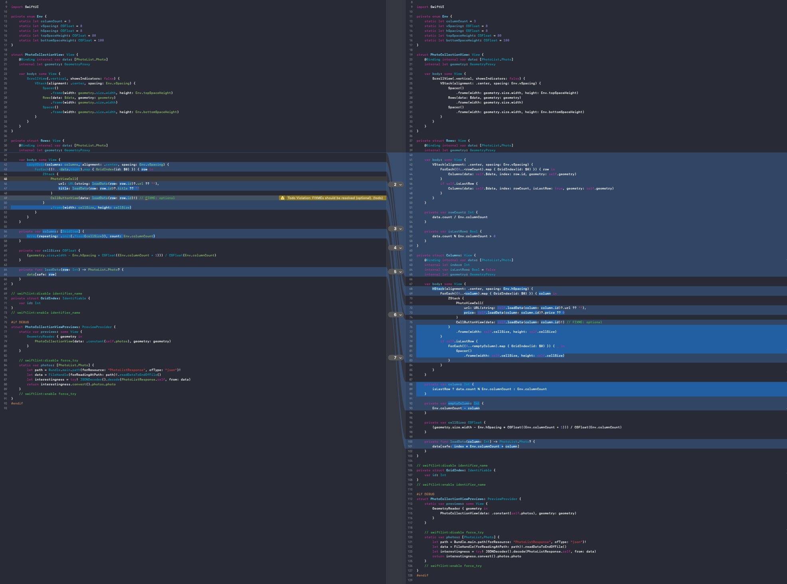

#  SwiftUI sample using LazyVGrid
It is a practical application using LazyVGrid announced at WWDC2020. As soon as you download it, you'll see how great it is.  
It's a beta version, so you need to be aware that it may not work properly with the official release.

# Installation
Run this script to install it.
```sh
$ ./setup.sh
```

This application uses Flickr to search for images to display. First, get the Flickr API key from [here](https://www.flickr.com/services/api/).  
Next, set the acquired character string in `KeyHelper.consumerKey` and `KeyHelper.consumerSecret` respectively.
```swift
import Foundation

enum KeyHelper {
    static var consumerKey: String {
        "XXXXXXXXXX"
    }
    static var consumerSecret: String {
        "XXXXXXXXXX"
    }
}
```

# You can write more simply

The left is an example using `LazyVGrid`. And the right is an example of not using `LazyVGrid` at all. You can see that it is now very simple to implement.  
Evolution doesn't stop there.  
As its name suggests, LazyVGrid can handle delayed rendering. The drawing of each View is only started when it is displayed on the screen.

# Official documentation
- [LazyVGrid](https://developer.apple.com/documentation/swiftui/lazyvgrid)
- [LazyHGrid](https://developer.apple.com/documentation/swiftui/lazyhgrid)

# Requirements
|env  |version |
|---    |---   |
|Swift  |5.x   |
|Xcode  |12.x  |
|iOS    |14.x  |

# License
AkkeyLab/LazyGrid is available under the MIT license. See the LICENSE file for more info.
